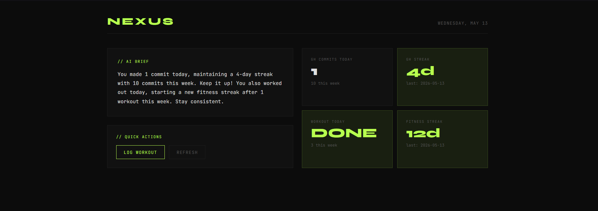
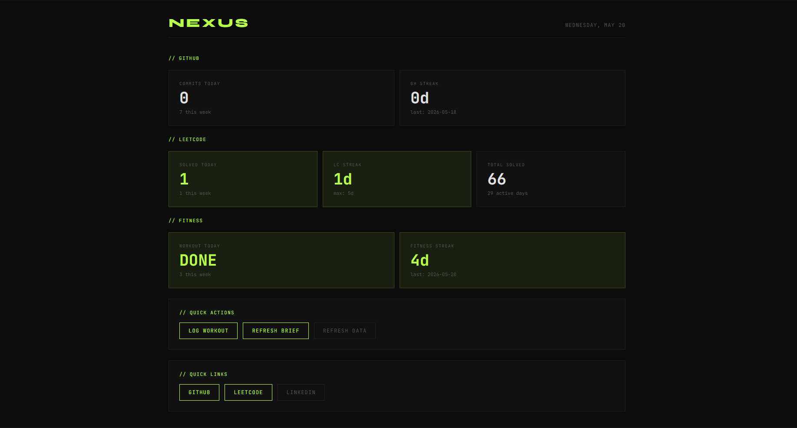
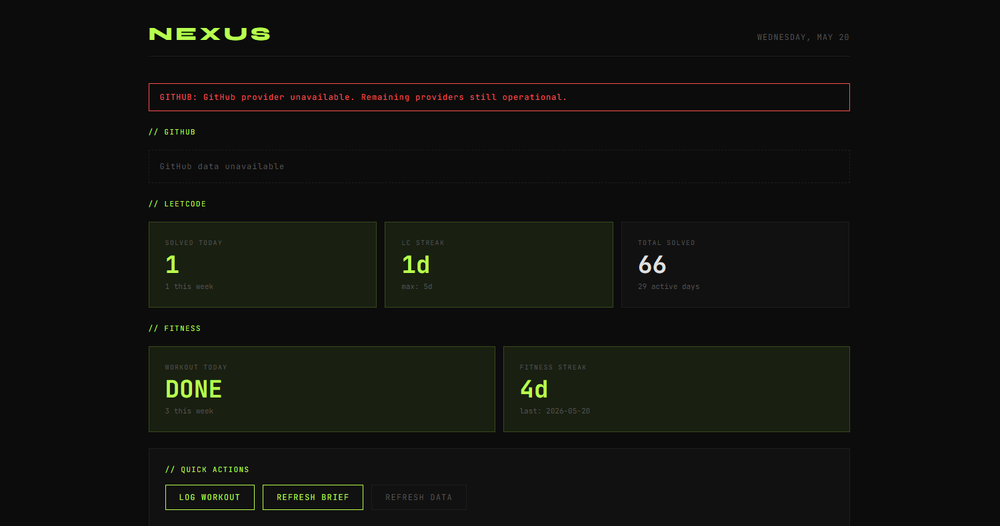
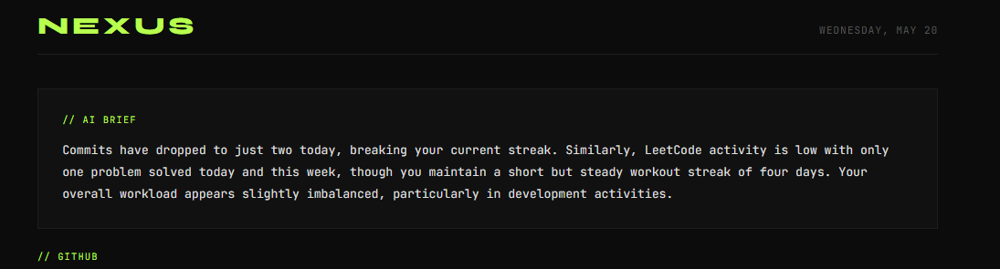

# NEXUS — Local-First Developer Intelligence Platform

NEXUS is a self-hosted developer telemetry dashboard powered by modular MCP providers and optional local AI summarization.

It aggregates activity streams from sources like GitHub, LeetCode, and fitness tracking into a focused operational view designed to reduce cognitive overhead and surface what actually matters.

No cloud backend.  
No telemetry.  
No mandatory AI dependency.  
Everything runs locally.
---


---

# Philosophy

Most productivity tools increase cognitive load by turning your life into a wall of widgets, charts, and notifications.

NEXUS takes the opposite approach:

- Focused operational UI
- Contextual awareness over analytics clutter
- Local-first execution
- Modular provider architecture
- Optional AI augmentation
- Graceful degradation under failure

The goal is not to track everything.

The goal is to surface what matters.

---

# Architecture

```text
MCP Providers
├── GitHub
├── LeetCode
└── Fitness
        ↓

FastAPI Aggregation Layer
├── async provider orchestration
├── reliability layer
├── SQLite snapshot persistence
└── optional Ollama summaries
        ↓

React Frontend
├── operational dashboard
├── provider sections
└── adaptive metric rendering
```

---

# Features

## Developer Telemetry

- GitHub contribution tracking via GraphQL
- LeetCode streak and activity analysis
- Local fitness/workout tracking
- Historical snapshot persistence via SQLite

---

## AI Layer

- Contextual AI-generated daily summaries
- Local inference using Ollama
- Daily summary caching
- Manual refresh support
- Fully optional AI integration

NEXUS remains fully functional without Ollama enabled.

---

## Reliability

- Provider isolation — one failing provider never crashes the dashboard
- Graceful degradation during provider failures
- Partial rendering support
- Explicit operational error states
- Trend-ready local persistence

---

## Extensibility

- Modular MCP provider architecture
- Independent provider execution via stdio transport
- Language-agnostic provider support
- Easy integration of new data sources

---

# Dashboard

## Healthy State



---

## Graceful Degradation

Even when a provider fails, the dashboard continues rendering remaining providers safely.



---
## AI Brief Example

NEXUS treats AI as an optional contextual intelligence layer rather than a motivational assistant.

The briefing system is designed to generate concise operational summaries from aggregated developer telemetry using locally hosted LLMs via Ollama.

The focus is:
- operational signals
- workload balance
- streak awareness
- operational context

NOT:
- generic productivity coaching
- motivational advice
- artificial positivity

Example generated brief:




The AI layer is fully optional and runs entirely locally through Ollama.

---

# Why MCP?

NEXUS uses MCP providers to isolate data sources into independent modules communicating over stdio transport.

This architecture allows:

- Provider isolation
- Isolated provider execution
- Easier extensibility
- Language-agnostic integrations
- Graceful degradation between providers

Each provider is independently runnable and testable.

---

# Local-First Design

NEXUS is intentionally designed around ownership and local execution.

There are:
- no hosted accounts
- no telemetry collection
- no mandatory cloud inference
- no centralized backend

Your data stays on your machine.

---

# Optional AI Layer

Ollama integration is completely optional.

When enabled:
- local LLMs generate contextual summaries from aggregated activity data
- summaries are cached daily to avoid unnecessary inference

When disabled:
- NEXUS continues functioning as a lightweight operational dashboard

AI enhances the platform but does not define it.

---

# Tech Stack

## Backend
- Python
- FastAPI
- SQLite
- AsyncIO
- Pydantic
- MCP Protocol
- GraphQL

---

## Frontend
- React
- TypeScript
- Vite

---

## AI
- Ollama
- Local LLM inference

---

# Prerequisites

- Python 3.11+
- Node.js 18+
- Ollama (optional)
- GitHub Personal Access Token

---

# Setup

## 1. Clone Repository

```bash
git clone https://github.com/Acestar21/nexus.git
cd nexus
```

---

## 2. Configure Environment

```bash
cp .env.example .env
```

Fill in your environment variables.

---

## 3. Install Dependencies

```bash
make install
```

---

## 4. Start Development Environment

```bash
make dev
```

Frontend:
```text
http://localhost:5173
```

Backend:
```text
http://localhost:8000
```

---

## Running NEXUS

### Quick Start

After completing setup and configuring `.env`:

#### Windows
```bash
start.bat
```

#### Linux / macOS
```bash
chmod +x start.sh
./start.sh
```

This launches:
- FastAPI backend
- React frontend
- local MCP providers

and opens the dashboard locally.

---

### Manual Development Mode

If developing or debugging:

#### Backend
```bash
cd backend
uvicorn app.main:app --reload
```

#### Frontend
```bash
cd frontend
npm run dev
```

---

# Environment Variables

| Variable | Required | Description |
|---|---|---|
| `GITHUB_TOKEN` | Yes | GitHub Personal Access Token |
| `GITHUB_USERNAME` | Yes | GitHub username |
| `LEETCODE_USERNAME` | Yes | LeetCode username |
| `FITNESS_LOG_PATH` | No | Path to local fitness JSON |
| `ENABLE_AI_BRIEF` | No | Enable Ollama AI summaries |
| `OLLAMA_HOST` | No | Ollama host |
| `OLLAMA_MODEL` | No | Ollama model name |

---

### GitHub Token Setup 

A GitHub token is required for private contribution activity to be included in dashboard metrics.
The token is only used to access contribution data associated with the authenticated GitHub account.

Create a classic Personal Access Token with:

- `read:user`
- `repo`

GitHub Settings:
```text
Settings → Developer Settings → Personal Access Tokens → Tokens (classic)
```

Then add it to:

```env
GITHUB_TOKEN=your_token_here
```

---

# Project Structure

```text
nexus/
├── backend/
│   └── app/
│       ├── routers/
│       │   └── dashboard.py
│       ├── config.py
│       ├── db.py
│       ├── mcp_client.py
│       └── ollama_client.py
│
├── frontend/
│   └── src/
│       ├── components/
│       ├── hooks/
│       ├── App.tsx
│       └── types.ts
│
├── mcp-servers/
│   ├── github/
│   ├── leetcode/
│   └── fitness/
│
├── docs/
├── CONTRIBUTING.md
├── README.md
└── Makefile
```

---

# Adding Your Own Provider

Adding a new data source typically means:
- creating one MCP provider
- registering it in the backend
- rendering the metrics in the frontend

See:
```text
CONTRIBUTING.md
```

for provider architecture and implementation details.

---

# Design Principles

NEXUS prioritizes:

- Clarity over density
- Reliability over complexity
- Local-first ownership
- Modular architecture
- Operational awareness
- Focused UX over dashboard clutter

---


# Contributing

Contributions are welcome.

Please read:

[CONTRIBUTING.md](./CONTRIBUTING.md)


before opening pull requests or proposing major architectural changes.

---

# License

[MIT License](./LICENSE)

---

Built and maintained by Kushal Singh Kushwaha.